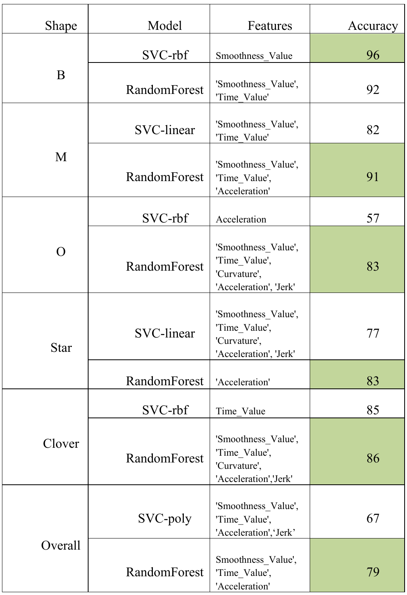
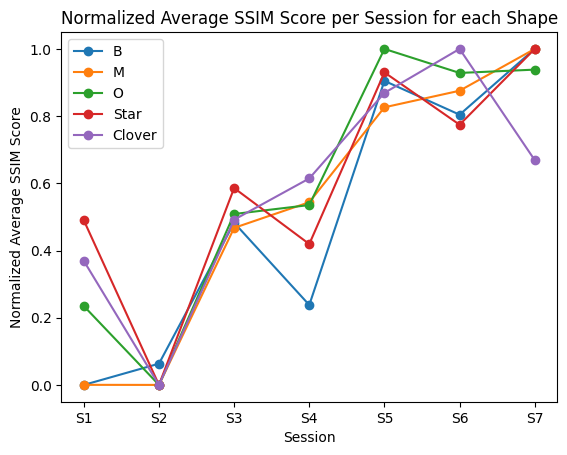
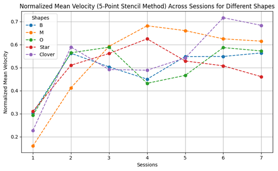

# Motor Learning Assessment from Foot-Drawn Shapes

This research project investigates whether progression in a novel motor task can be identified from movement trajectories recorded across repeated practice sessions. Participants reproduced five shapes with their foot over seven sessions, and the resulting trajectories were analyzed through structural similarity, movement timing, kinematics, clustering, and supervised classification.

This B.Sc. project was completed under the supervision of [Dr. Fariba Bahrami](https://scholar.google.com/citations?user=cP6BfUMAAAAJ&hl=en), Associate Professor in the School of Electrical and Computer Engineering at the University of Tehran.

> **Data privacy:** Participant-level recordings, coordinates, drawings, spreadsheets, and derived feature tables are confidential and are intentionally excluded from this public repository. Only de-identified aggregate figures and methodological documentation are published here.

## Research question

Can changes in trajectory shape and movement dynamics distinguish early practice from later stages of learning, both across the group and for a participant not seen during training?

The study included:

- 12 healthy volunteers (6 women and 6 men; mean age approximately 23 years)
- 7 practice sessions
- 5 target shapes: **B**, **M**, **O**, **Star**, and **Clover**
- 5 repetitions of each shape per session

The aim was not only to measure improvement, but also to determine which movement characteristics best describe the transition from beginner to more practiced performance.

## Analysis workflow

### 1. Trajectory preprocessing

The recorded coordinates required several corrections before features could be compared reliably:

- normalized coordinate conventions that differed between acquisition sessions;
- removed repeated samples caused by coordinate quantization;
- reconstructed missing intervals with linear interpolation;
- resampled trajectories to a consistent 200 Hz temporal basis;
- handled incomplete endpoints and obvious velocity outliers; and
- smoothed signals before computing higher-order derivatives.

Velocity, acceleration, and jerk were estimated with a five-point finite-difference stencil to reduce the instability of simple numerical differentiation.

### 2. Feature extraction

Each trial was represented using complementary structural and kinematic measurements:

| Feature | What it captures |
| --- | --- |
| Structural Similarity Index (SSIM) | Resemblance between a participant's drawing and the reference shape |
| Movement time | Duration required to complete the drawing |
| Mean tangential velocity | Overall movement speed |
| Curvature | Changes in the trajectory's direction and geometry |
| Acceleration | Changes in movement velocity |
| Jerk | Rapid changes in acceleration |
| Smoothness | Continuity and control of the movement |

### 3. Unsupervised analysis

The analysis compared several approaches for discovering learning-related structure without stage labels:

- K-means;
- kernel PCA followed by K-means;
- Gaussian mixture models;
- spectral clustering; and
- kernel PCA followed by spectral clustering.

The most successful shape-specific clustering result was obtained for the **Star** trajectory with a Gaussian mixture model, reaching **96%** agreement with the evaluated learning-stage grouping. Performance varied by shape, showing that geometric complexity and movement strategy affected how clearly sessions separated.

### 4. Supervised learning and validation

Support-vector classifiers with linear, radial-basis, and polynomial kernels were compared with decision trees and random forests. Statistical feature ranking, recursive feature elimination, and L1 regularization were explored for feature selection.

Two validation settings were used:

- conventional cross-validation to compare session groupings and feature subsets; and
- leave-one-subject-out (LOSO) validation to test generalization to an unseen participant.

The best cross-validated learning-stage classifier reached **82% accuracy** when comparing session 1 with sessions 5–7, with movement duration and curvature emerging as especially informative. In the stricter participant-independent evaluation, the best LOSO result reached **81% accuracy** for the same early-versus-late session grouping using a broader set of kinematic features.

## Aggregate results

### Final shape-specific classification results



The final leave-one-subject-out evaluation compared the strongest support-vector classifier and Random Forest configuration for each shape:

| Shape | SVC model | SVC accuracy | Random Forest accuracy |
| --- | --- | ---: | ---: |
| B | RBF | **96%** | 92% |
| M | Linear | 82% | **91%** |
| O | RBF | 57% | **83%** |
| Star | Linear | 77% | **83%** |
| Clover | RBF | 85% | **86%** |
| All shapes | Polynomial | 67% | **79%** |

The **96%** result is the highest shape-specific accuracy, whereas **79%** is the best pooled result across all five shapes. This distinction matters: the per-shape models can specialize in one trajectory geometry, while the pooled model must generalize across substantially different shapes.

### Subject-independent session-grouping results

The best subject-independent session grouping compared session 1 with sessions 5–7 and reached **81% LOSO accuracy** using mean velocity, smoothness, movement time, curvature, acceleration, and jerk. Session 1 versus sessions 6–7 reached **80% LOSO accuracy**. These experiments test whether early and later learning stages remain distinguishable for a participant completely excluded from model training.

### Structural similarity over practice



The aggregate SSIM curves generally rise in later sessions, indicating that reproduced trajectories became structurally closer to their target shapes. The pattern is not perfectly monotonic: individual shapes show temporary drops, which is expected in a small repeated-measures motor-learning study.

### Movement velocity over practice



Mean velocity changed substantially after the first session, but its later evolution differed across shapes. This supports using several structural and kinematic features together rather than treating speed alone as a universal measure of learning.

## Main findings

- Later-session drawings were generally more similar to the intended shapes.
- Movement duration, curvature, smoothness, and acceleration contributed useful learning-stage information.
- Classification quality depended on the target shape; one model and feature subset did not dominate every condition.
- Strong shape-specific scores did not automatically translate into equally strong performance when all shapes were pooled.
- Participant-independent validation remained above 80% in the best early-versus-late configuration, suggesting that the extracted features captured patterns beyond individual drawing style.

## Public reference implementation

The repository includes the original analysis code as a regular Python file at `analysis/motor_learning_analysis.py`. Its sections preserve the order of the 53 original notebook code cells and cover MAT-file loading, movement-feature extraction, SSIM analysis, classification, leave-one-subject-out validation, and clustering. Saved outputs, embedded figures, execution state, and attachments were not transferred because the underlying study data are confidential.

The `src/motor_learning` package additionally provides a compact, data-independent reference implementation of the main computational steps described in the presentation:

- removal of consecutive repeated samples;
- linear resampling to a fixed frequency;
- trajectory smoothing;
- five-point numerical differentiation;
- movement-time, path-length, velocity, curvature, acceleration, and jerk features; and
- leave-one-participant-out evaluation for an aggregate feature matrix.

The original analysis was supplied separately from the private data archive and exported to a sectioned Python script using `# %%` markers. The reusable package is a clean **reference implementation reconstructed from the documented methodology**; it does not replace or rewrite the original analysis.

To inspect or run the full analysis in a compatible environment:

```bash
python -m pip install -r requirements-analysis.txt
```

The analysis script retains its original Google Colab directory references so the published code remains traceable to the experiment. Running it still requires authorized access to the excluded `.mat`, image, CSV, and spreadsheet inputs.

No study data are required to check the pipeline. The included example generates a synthetic ellipse:

```bash
python -m pip install -r requirements.txt
$env:PYTHONPATH = "src"  # PowerShell
python examples/synthetic_demo.py
```

For participant-independent evaluation, anonymized participant labels may be passed to `leave_one_participant_out_accuracy` only as fold groups. They are never included among the predictive features.

## Limitations and next steps

This was an exploratory study with a small cohort, and some acquisition inconsistencies required careful preprocessing. Future work could expand the participant pool, separate simple and complex shapes more explicitly, improve velocity-derived descriptors, add statistical and learned trajectory representations, and evaluate deep-learning models once a sufficiently large dataset is available. The same framework could also be adapted to rehabilitation tasks in which changes in movement control must be monitored over time.

## Repository contents

```text
.
├── analysis/
│   └── motor_learning_analysis.py
├── examples/
│   └── synthetic_demo.py
├── figures/
│   ├── final-results-table.png
│   ├── mean-velocity-by-session.png
│   └── ssim-by-session.png
├── src/motor_learning/
│   ├── __init__.py
│   ├── evaluation.py
│   ├── features.py
│   └── preprocessing.py
├── .gitignore
├── README.md
├── requirements-analysis.txt
└── requirements.txt
```
